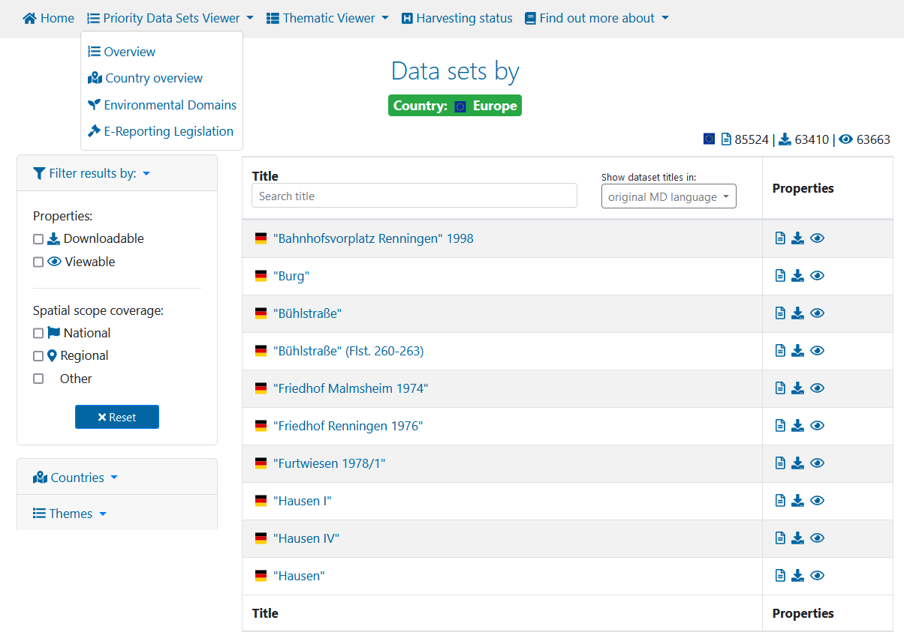
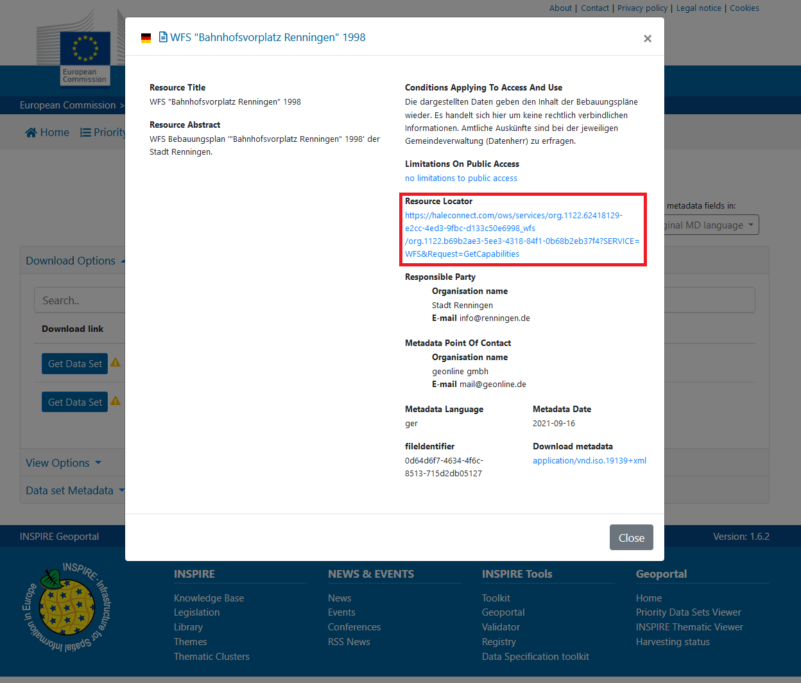

# WFS services

The Web Feature Service (WFS) represents a change in the way geographic information is created, modified and exchanged on the Internet. Rather than sharing geographic information at the file level, the WFS offers direct fine-grained access to geographic information at the feature and feature property level.

In ETF, we validate if these services follow the basic requirements for WFS services set by INSPIRE

You can test your own WFS services in the ETF.

In case you do not have any of your own WFS services available, you can also use an external WFS service to explore the capabilities of the ETF.
You can find WFS services from a multitude of sources such as the INSPIRE Geoportal.
The INSPIRE Geoportal is the central European access point to the data provided by EU Member States and several EFTA countries under the INSPIRE Directive. The Geoportal allows:
* monitoring the availability of INSPIRE data sets;
* discovering suitable data sets based on their descriptions (metadata);
* accessing the selected data sets through their view or download services.

You can explore this geoportal and select services with the criteria you want from its [search engine](https://inspire-geoportal.ec.europa.eu/results.html?country=eu&view=details&theme=none).

Once you have located a service, you can obtain its url for use in the ETF by clicking on the datasets downloadable icon and obtain its url through the information reflected in the resources locator parameter from the service metadata.

