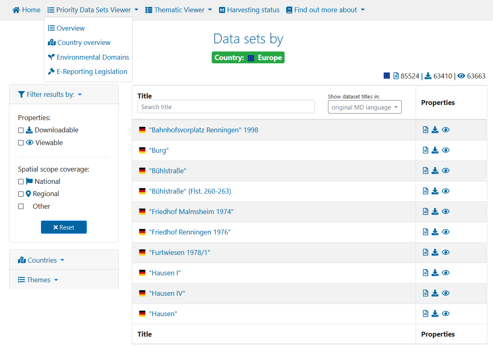
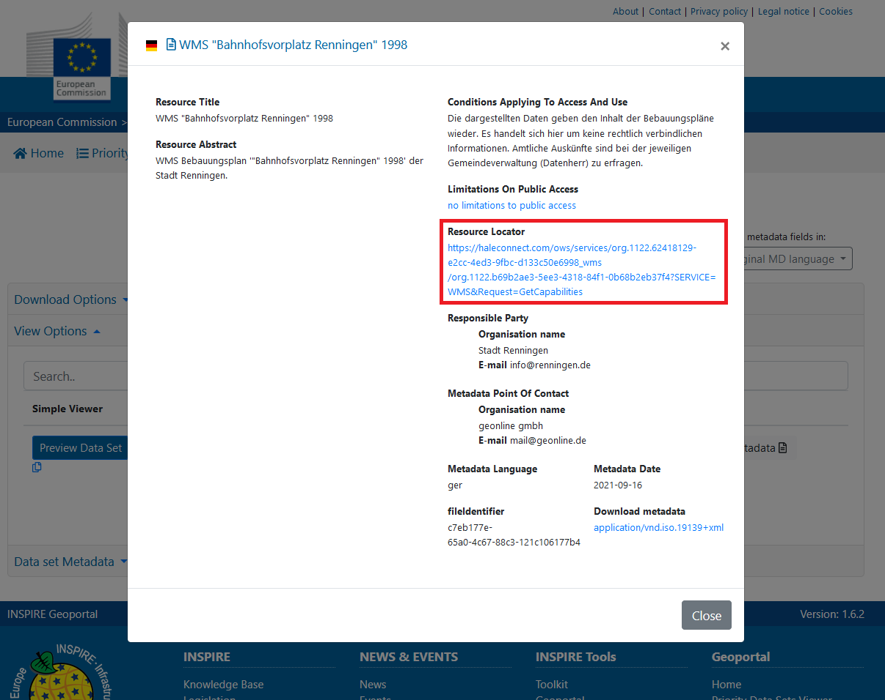

# WMS services

A Web Map Service is a standard protocol developed by the Open Geospatial Consortium in 1999 for serving georeferenced map images over the Internet. These images are typically produced by a map server from data provided by a GIS database. 

In ETF, we validate if these services follow the basic requirements for WMS services set by INSPIRE.

You can test your own WMS services in the ETF.

In case you do not have any of your own WMS services available, you can also use an external WMS service to explore the capabilities of the ETF.
You can find WMS services from a multitude of sources such as the INSPIRE Geoportal.
The INSPIRE Geoportal is the central European access point to the data provided by EU Member States and several EFTA countries under the INSPIRE Directive. The Geoportal allows:
* monitoring the availability of INSPIRE data sets;
* discovering suitable data sets based on their descriptions (metadata);
* accessing the selected data sets through their view or download services.

You can explore this geoportal and select services with the criteria you want from its [search engine](https://inspire-geoportal.ec.europa.eu/results.html?country=eu&view=details&theme=none).

Once you have located a service, you can obtain its url for use in the ETF by clicking on the datasets viewable icon and obtain its url through the information reflected in the resources locator parameter from the service metadata.

